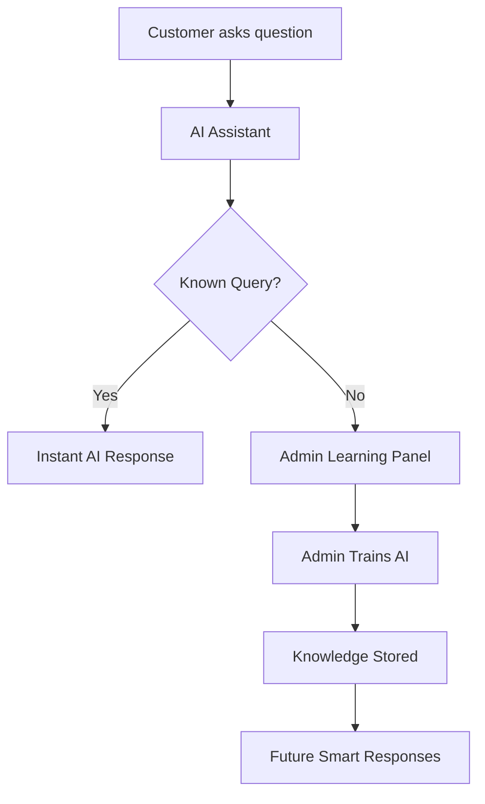

# 🤖 Return & Refund Assistant — PRJ-121

### *AI-Powered E-Commerce Support Ecosystem*

<div align="center">


<br/>
<br/>

### 🌐 Live Demo

🚀 **Experience the Project Live:**
👉 **[https://return-refund-assistant-prj-121-ysu.vercel.app/](https://return-refund-assistant-prj-121-ysu.vercel.app/)**

---

### ⚡ “Where AI meets futuristic customer support.”

</div>

---

# 📸 Preview

<p align="center">
  
</p>

---

# 🌌 About The Project

**Return & Refund Assistant (PRJ-121)** is a futuristic AI-inspired e-commerce support platform designed to simplify the entire refund and return workflow.

Unlike traditional support systems, this platform creates an immersive **cyberpunk-style digital experience** while integrating:

* 🤖 AI-powered customer assistance
* 📦 Real-time delivery simulation
* 💬 Smart refund conversations
* 🧠 Admin AI-learning workflow
* 💳 Wallet-based refund handling
* 📊 Live monitoring dashboard

The project focuses on combining **modern UI/UX**, **frontend intelligence**, and **interactive workflows** into a single seamless ecosystem.

---

# ✨ Core Features

---

## 👤 Customer Panel

### 🛍️ Smart Shopping Experience

* Interactive product browsing
* Modern product cards with hover animations
* Virtual wallet integration

### 🚚 Live Delivery Tracking

* Real-time animated GPS-style tracking
* Dynamic arrival estimates
* Smooth motion-based transitions

### 🤖 AI Return Assistant

* Intelligent chatbot interface
* Handles refund and return queries
* Learns dynamically from admin responses

### 💸 Refund Request System

* Quick refund submission
* Return status monitoring
* Instant history tracking

---

## 🛡️ Admin Dashboard

### 📡 Live Activity Monitor

* Track orders, chats, and refund activity
* Real-time customer interaction feed

### 💰 Refund Control Center

* Approve or reject refunds
* Apply deduction/service charges
* Wallet refund management

### 🧠 AI Learning Engine

* Admin teaches unknown queries
* AI stores trained responses
* Dynamic future query matching

### 📊 System Analytics

* Pending requests overview
* Activity statistics
* Dashboard insights

---

# 🎨 UI / UX Highlights

## 🌃 Cyberpunk + Anime Inspired Design

The interface is heavily inspired by:

* 🌌 Neon City aesthetics
* 🟣 Glassmorphism
* ⚡ Futuristic animations
* 🌙 Dark-mode environments
* 🎥 Motion-driven interactions

### ✨ Visual Effects Included

* Blurred glass panels
* Neon glowing borders
* Animated gradients
* Floating backgrounds
* Responsive transitions

---

# 🧠 AI Workflow Concept



---

# ⚙️ Tech Stack

| Technology        | Purpose            |
| ----------------- | ------------------ |
| ⚡ Next.js 15      | Frontend Framework |
| 🎨 Tailwind CSS   | Styling & UI       |
| 🎞️ Framer Motion | Animations         |
| 🧠 localStorage   | Data Persistence   |
| 🪄 Lucide React   | Icons              |
| 🌐 Vercel         | Deployment         |

---

# 🏗️ Architecture

## 🔥 Self-Sustaining Frontend Architecture

This project intentionally avoids backend/database complexity to create a fully demo-ready ecosystem.

### 💾 Storage

* Browser-native `localStorage`
* No external database required

### 🧠 AI Simulation

* Fuzzy matching logic
* Admin-trained response engine
* Real-time learning simulation

### 🔄 Live Shared Experience

Both Admin and Customer interfaces operate using the same local browser storage, enabling:

* Instant updates
* Shared learning
* Real-time interaction simulation

---

# 🚀 Getting Started

## 📋 Prerequisites

* Node.js v18+
* npm

---

## 📥 Installation

```bash
# Clone repository
git clone https://github.com/your-username/return-refund-assistant.git

# Enter project folder
cd return-refund-assistant

# Install dependencies
npm install
```

---

## ▶️ Run Development Server

```bash
npm run dev
```

Visit:

```bash
http://localhost:3000
```

---

# 📂 Project Structure

```bash
return-refund-assistant/
│
├── app/
├── components/
├── public/
├── styles/
├── utils/
├── hooks/
│
├── package.json
├── tailwind.config.js
└── README.md
```

---

# 📸 Screenshots

## 🏠 Landing Page

<p align="center">
  
</p>

---

## 🤖 AI Chat Assistant

<p align="center">
  
</p>

---

## 📊 Admin Dashboard

<p align="center">
  
</p>

---

# 🌟 Why This Project Stands Out

✅ Combines AI + E-Commerce + Futuristic UI
✅ Fully interactive without backend setup
✅ Real-time admin-to-AI learning workflow
✅ Strong presentation-ready visual design
✅ Modern frontend engineering concepts
✅ Smooth animations and immersive UX

---

# 📌 Future Enhancements

* 🔗 Real AI API integration
* ☁️ Cloud database support
* 📱 Mobile app version
* 🧾 Invoice generation
* 🌍 Multi-language support
* 📦 Real logistics API integration

---

# 👨‍💻 Developer

## 🧑‍🎓 Student Details

| Field           | Value                          |
| --------------- | ------------------------------ |
| 👤 Name         | **VARSHEN A PDKV**             |
| 🆔 Project Code | **PRJ-121**                    |
| 🎓 Department   | **Cyber Security**             |
| 💡 Domain       | **GenAI + E-Commerce Support** |

---

# 📜 License

This project is licensed under the **MIT License**.

---

# ⭐ Support

If you liked this project:

🌟 Star the repository
🍴 Fork the project
🚀 Share the demo

---

<div align="center">

# ⚡ Built with Passion, AI & Cyberpunk Energy ⚡

</div>
